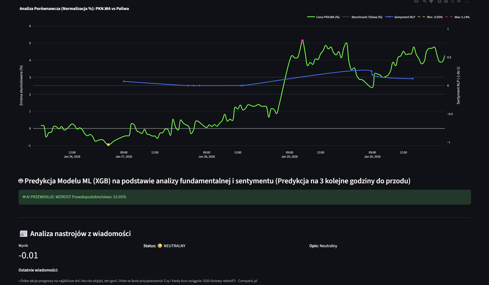

# 📈 Financial AI Terminal & Sentiment Predictor

Financial analysis platform that integrates **Fundamental Analysis**, **Technical Indicators**, and **NLP-driven Sentiment** to forecast short-term price movements using **XGBoost**.

---


## 🖼️ Preview

### Dashboard Overview

*The main terminal view showing real-time price action, sentiment trends, and the floating AI clock.*

### AI Predictions & Fundamentals

*Hybrid XGBoost prediction engine with detailed fundamental tooltips.*

## 🚀 Core 

This project moves beyond simple price-action forecasting by merging three distinct pillars of quantitative trading:
1.  **360° Market Context**: Interactive candlestick charts coupled with **Alpha-tracking** (Sector-relative performance normalized to a $y=0$ baseline).
2.  **Sentiment Intelligence**: Real-time and historical news analysis using the **FinBERT** (Financial BERT) model to quantify market mood.
3.  **Machine Learning**: **XGBoost** classifier that processes macro and sentiment features to predict price direction (Up/Down) for the next **3 hours**.

---

## 🛠 Tech Stack

* **Frontend**: [Streamlit](https://streamlit.io/) (Real-time Dashboarding)
* **Data Sources**: `yfinance` (Prices & Fundamentals), SQLite (Sentiment History)
* **Technical Analysis**: `pandas-ta`, `stockstats`
* **Machine Learning**: **XGBoost** (Gradient Boosted Decision Trees)
* **NLP**: HuggingFace `FinBERT` (Sentiment Classification: -1 to 1)

---

## 📊 Key Features

### 1. Multi-Factor Hybrid Model
The prediction engine doesn't just look at candles; it analyzes the interplay between:
* **Technical Momentum**: RSI (14), EMA (20), and Relative Price Change.
* **Macro Correlations**: USD/PLN exchange rates and Brent Oil price fluctuations.
* **Sentiment Metrics**: Average Sentiment Score and News Volume (Attention Surge detection).
* **Core Fundamentals**: P/E Ratio, P/B Ratio, and Net Profit Margins.


### 2. Alpha Visualization (Relative Strength)
Instead of absolute price, the terminal plots **Relative Strength**. By setting the sector benchmark to $y=0$, users can instantly see if a stock is outperforming its peers, regardless of overall market volatility.

### 3. Interactive Fundamental Header
The dashboard features a real-time fundamental summary. Each metric (P/E, P/B, Dividend Yield) is equipped with an interactive tooltip explaining the financial logic behind the number, providing an educational layer to the analysis.

### 4. Real-Time Dynamic UI
Includes a floating, real-time digital clock and dynamic data refreshing to ensure the AI signals are always based on the latest market conditions.

### 5. Sector Heatmap

---

## 🏗 Project Structure

* `app.py`: The main entry point. Handles the UI, Plotly visualizations, and real-time data orchestration.
* `train.py`: A dedicated script for training/retraining XGBoost models for each ticker.
* `model_predictor.py`: The inference engine class that loads `.pkl` models and generates real-time signals.
* `sentiment_worker.py`: Processes news headlines through FinBERT and manages the SQLite sentiment database.
* `config.py`: Centralized configuration for tickers, sector benchmarks, and model paths.

---

## 🚦 Getting Started

### Prerequisites
* Python 3.9+
* Virtual environment (recommended)

### Installation
1.  **Clone the repository:**
    ```bash
    [git clone [https://github.com/youruser/financial-ai-terminal.git](https://github.com/youruser/financial-ai-terminal.git)
    cd financial-ai-terminal](https://github.com/MichalPytlarz/Analiza_gieldy_live.git)
    ```
2.  **Install dependencies:**
    ```bash
    pip install -r requirements.txt
    ```
3.  **Train the AI models:**
    ```bash
    python training/train.py
    python services/sentiment_worker.py
    ```
4.  **Launch the terminal:**
    ```bash
    streamlit run app.py
    ```

---

## ⚠️ Disclaimer
*This software is for educational and research purposes only. The stock market involves significant risk. Predictions generated by the AI model should not be taken as financial advice. Always perform your own due diligence.*
