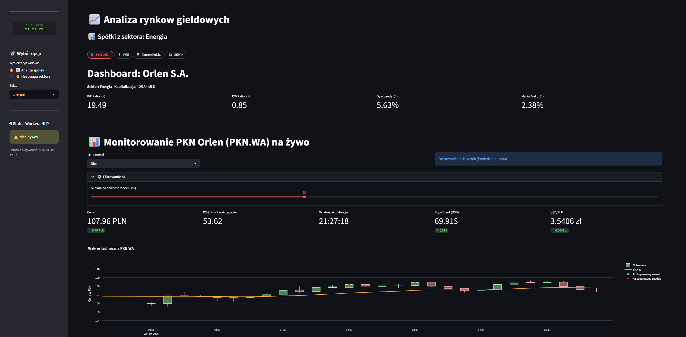
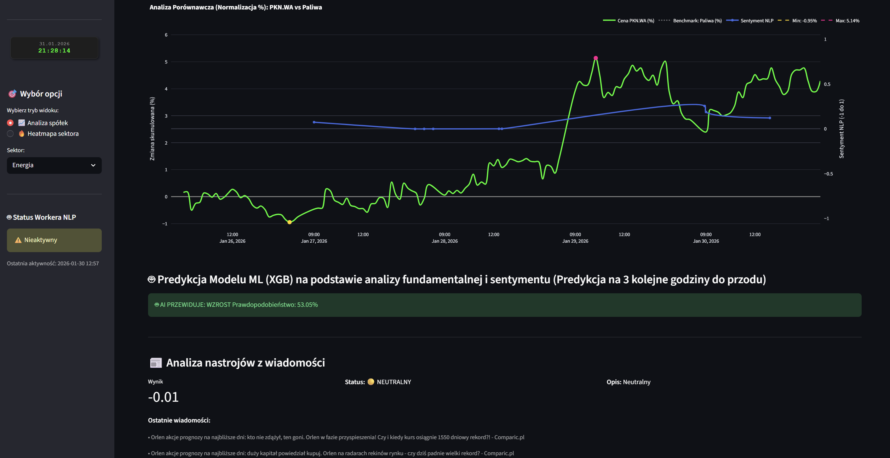
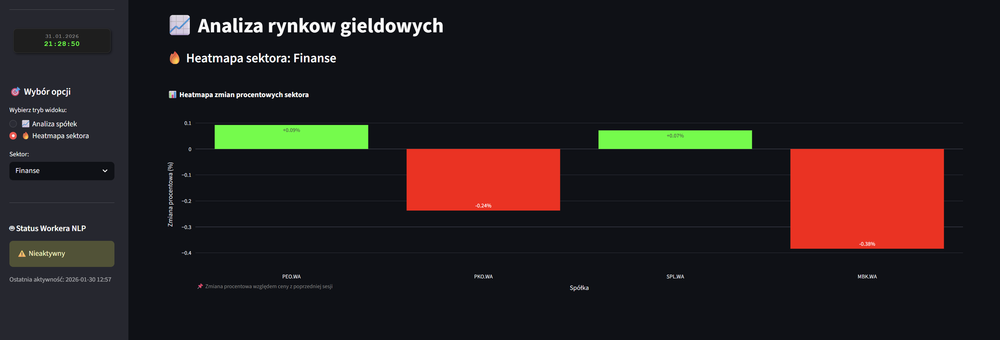
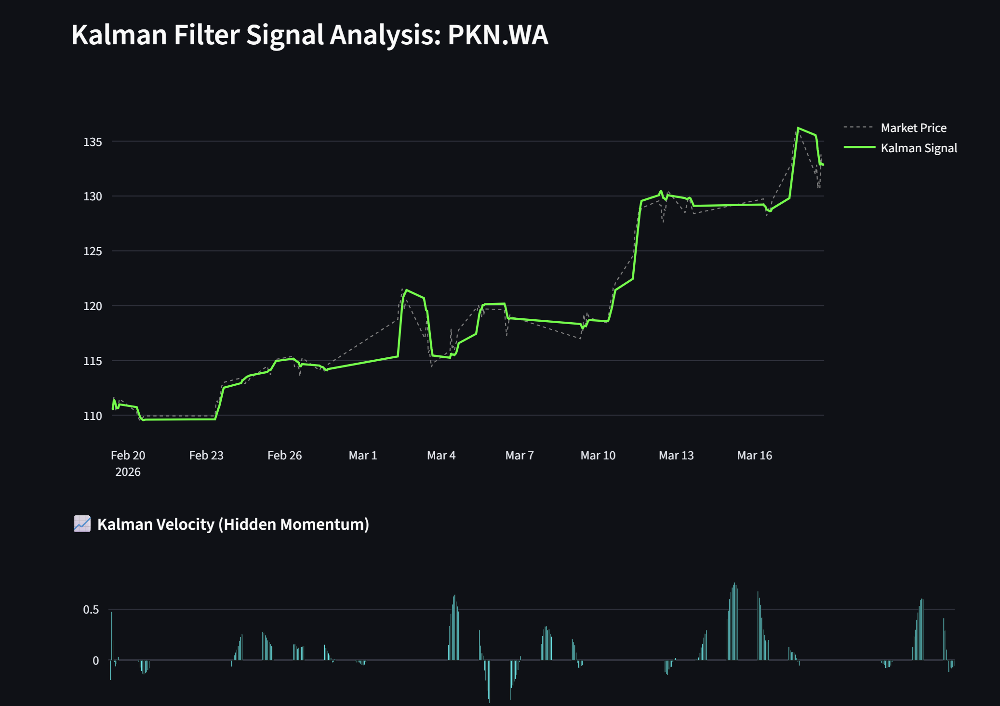

# 📈 Financial AI Terminal & Sentiment Predictor

Financial analysis platform that integrates **Fundamental Analysis**, **Technical Indicators**, and **NLP-driven Sentiment** to forecast short-term price movements using **XGBoost**.

---

## 🚀 Core 
1.  **NLP Scraping**: Scans 50 financial news sources per ticker to extract and summarize key market drivers.
2.  **Hybrid AI Prediction**: XGBoost classifier predicting 3-hour price direction based on technical, fundamental, and sentiment data.
3.  **Sector Intelligence**: Dynamic heatmaps for visualizing relative performance across industries.

---

## 🛠 Tech Stack

* **Frontend**: [Streamlit](https://streamlit.io/) (Real-time Dashboarding)
* **Data Sources**: `yfinance` (Prices & Fundamentals), SQLite (Sentiment History)
* **Technical Analysis**: `pandas-ta`, `stockstats`
* **Machine Learning**: **XGBoost** (Gradient Boosted Decision Trees)
* **NLP**: FinBERT & Scraping Engine (Processing headlines from 50+ web sources)

---

## 📊 Key Features

### 1. Deep Sentiment Analysis (NLP)
The engine scrapes and analyzes headlines from **50+ web sources** per ticker. It doesn't just score sentiment; it identifies and summarizes the most critical information affecting the stock.


### 2. Sector Heatmaps
Real-time sector visualization allows for instant identification of market leaders and laggards. Heatmaps adjust dynamically based on the selected industry sector.


### 3. Multi-Factor Hybrid Prediction
Predicts price movement for the next **3 hours** by correlating:
* **Momentum**: RSI, EMA.
* **Sentiment**: Aggregated score from 50+ news portals.
* **Fundamentals**: Real-time P/E, P/B, and Margin data with interactive tooltips.

---

## 🖼️ Preview

### Dashboard Overview

*The main terminal view showing real-time price action, sentiment trends, and the floating AI clock.*

### AI Predictions & Fundamentals


### Sector Heatmap


### Kalman Filter


--- 

## 🏗 Project Structure

* `app.py`: The main entry point. Handles the UI, Plotly visualizations, and real-time data orchestration.
* `train.py`: A dedicated script for training/retraining XGBoost models for each ticker.
* `model_predictor.py`: The inference engine class that loads `.pkl` models and generates real-time signals.
* `sentiment_worker.py`: Processes news headlines through FinBERT and manages the SQLite sentiment database.
* `config.py`: Centralized configuration for tickers, sector benchmarks, and model paths.

---

## 🚦 Getting Started

### Prerequisites
* Python 3.9+
* Virtual environment (recommended)

### Installation
1.  **Clone the repository:**
    ```bash
    [git clone [https://github.com/youruser/financial-ai-terminal.git](https://github.com/youruser/financial-ai-terminal.git)
    cd financial-ai-terminal](https://github.com/MichalPytlarz/Analiza_gieldy_live.git)
    ```
2.  **Install dependencies:**
    ```bash
    pip install -r requirements.txt
    ```
3.  **Train the AI models:**
    ```bash
    python training/train.py
    python services/sentiment_worker.py
    ```
4.  **Launch the terminal:**
    ```bash
    streamlit run app.py
    ```

---

## ⚠️ Disclaimer
*This software is for educational and research purposes only. The stock market involves significant risk. Predictions generated by the AI model should not be taken as financial advice. Always perform your own due diligence.*
